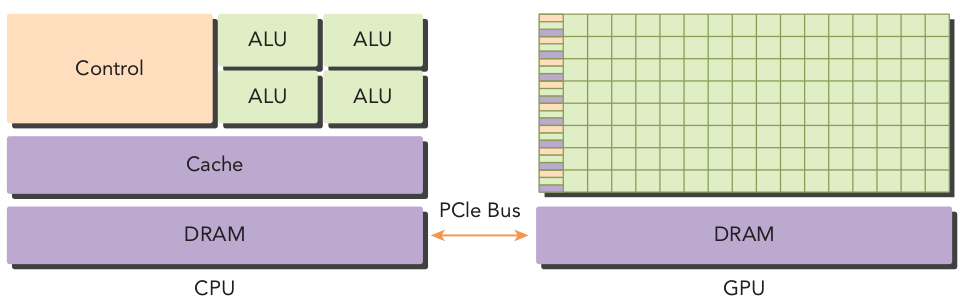

# Chapter 1 Heterogeneous Parallel Computing with CUDA

## 📌 Highlights
- Heterogeneous computing architectures combine two different, but complementary processor types - CPU and GPU.
- Parallel computing usually involves two distinct areas of computing technologies: computer architecture (hardware aspect) and pararllel programming (software aspect)
- CUDA is a general-purpose parallel computing platform and programming model.


A typical heterogeneous computing architecture may consist of two multicore CPU sockets and two or more many-core GPUs. GPUs operate in conjunction with a CPU-based host through a PCIe Bus. The CPU is called the *host* and the GPU is called the *device*. Note that *Host code* runs on CPUs and *device code* runs on GPUs. An application executing on a computing architecture is typically initialized by the CPU. The CPU code is responsible for managing the environment, code, and data for the device before loading expensive parallelizable tasks on the *device*.

## 🧪 Exercise 1-2
Remove the `cudaDeviceReset()` function from `hello.cu`, then cocmpile and run it to see what would happen.

### 🔑 Key Ideas
- The function `cudaDeviceReset()` will explicitly destroy and clean up all resources associated with the current device in the current process.
- Note that running memory profilers or leak checkers, such as `cuda-memcheck`, `nvprof`, or `Nsight Compute` can show memory leaks
- If the program runs CUDA code in a loop `cudaDeviceReset()` may be helpful to reinitialize the device for each iteration.
- Since this application is short and exits immediately, this is not needed.
- The control flow from CPU doesn't wait for GPU while it is running. This is covered in Exercise 1-3.

## 🧪 Exercise 1-3
Replace the function `cudaDeviceReset()` in `hello.cu` with `cudaDeviceSynchronize()`, then compile and run it to see what happens.

### 🔑 Key Ideas
- A kernel call is asynchronous with respect to the host thread. After a kernel is invoked, control returns to the host side immediately. The following function is to be called to force the host application to wait for all kernels to complete:
``` c
cudaError_t cudaDeviceSynchronize(void);
```
- This will wait for the GPU that is asynchronously running and not exit the program immediately.

### ✅ Execution Results
```bash
(main) root@C.21004476:/workspace/cuda_programming_works$ ./main
Hello World from CPU!
Hello World from GPU thread 0!
Hello World from GPU thread 1!
Hello World from GPU thread 2!
Hello World from GPU thread 3!
Hello World from GPU thread 4!
Hello World from GPU thread 5!
Hello World from GPU thread 6!
Hello World from GPU thread 7!
Hello World from GPU thread 8!
Hello World from GPU thread 9!
```

## 🧪 Exercise 1-6
Each thread that executes the kernel is given a unique thread ID that is accessible within the kernel through the built-in `threadIdx.x` variable. Modify the kernel function in `hello.cu` with the thread index to let the output be:

``` bash
$ ./hello
Hello World from CPU!
Hello World from GPU thread 5!
```

### 🔑 Key Ideas
- This is a quick introduction to CUDA Programming Model. Note that a CUDA kernel is executed with the given configuration of grid of thread blocks and block of threads. More details in Chapter 2. 
- The built-in `threadIdx.x` (further dimension with `threadIdx.y` and `threadIdx.z`) keeps the threads within the thread block unique and accessible.
- The desired output `Hello World from GPU thread 5!` is the output from 5-th thread the block. 

### 🛠️ Implementation Details
This is a code snippet from `hello.cu`. Note that there is a small divergence when `threadIdx.x == 4`. This, although it may result in the desired output, is not a recommended type of programming as threads in thread blocks run in SIMT fashion - möglichst ohne Divergence!


```cuda
__global__ void helloWorld(void){

    // exercise 1-6: let it print only for the 5-th thread.
    if (threadIdx.x == 4){
        printf("Hello World from GPU thread 5!\n");
    }
    //printf("Hello World from GPU thread %d!\n", threadIdx.x);
}
```

### ✅ Execution Results
The desired output is secured. It catches GPU thread 5!
```bash
(main) root@C.21004476:/workspace/cuda_programming_works$ ./main
Hello World from CPU!
Hello World from GPU thread 5!
```


<!---------------------------------------------------------------------------------

# Chapter 1

## 📌 Highlights
- 

## 🧪 Exercise 1-2


### 🔑 Key Ideas
- 


### 🛠️ (Optional) Implementation Details


### 📈 (Optioinal) Performance Metrics


### ✅ Execution Results
```bash
```

------------------------------------------------------------------------------->
