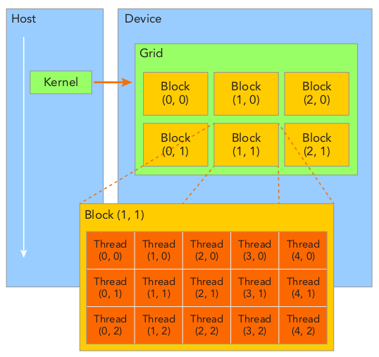

# Chapter 2 CUDA Programming Model

## 📌 Highlights
- Exposing a two-level thread hierarchy through the programming model is one of the CUDA's distinguishing features that lets you control a parallel environment. This two-level thread hierarchy consists of grid of thread blocks and threads in thread blocks. 
- Grid and block dimensions and their configurations could impact on the kernel performance. Learning how to organize the configurations under constraints is one of the central practices of CUDA programming.
- Grids and blocks represent a logical view of the thread layout for kernel execution. Note that naive implementations won't improve the performance.Different perspective, the hardware view, is covered in Chapter 3.
  <div style="display: inline-block; vertical-align: top;">
    <br>
    <strong>Figure 2-5. A two-level thread hierarchy (Cheng et al.)</strong><br>
  </div>

## 🧪 Exercise 2-1
Using the program `sumArraysOnGPU-timer.cu`, set the `block.x = 1023`. Recompile and run it. Compare the result with the execution configuration of `block.x = 1024`. Try to explain the difference and the reason.

### 🔑 Key Ideas
- Changing the number of blocks leads to different block sizes. If there are more threads in a block, less thread blocks are needed. 
- Less threads requires more thread blocks and this turns out to be the reason for execution time, because only a fixed number of thread blocks can run concurrently that depends on the architecture compute capability.

### 🛠️ Implementation Details
Changing the block size in `main()` to `1023` or `1024`. The grid size is adjusted accordingly.
``` cuda
// (.. snipped ..)
int iLen = 1023;
dim3 block (iLen);
dim3 grid  ((nElem + block.x - 1) / block.x); // truncated

// (.. snipped ..)
```

## 🧪 Exercise 2-2
Refer to `sumArraysOnGPU-timer.cu`, and let `block.x = 256.` Make a new kernel to let each thread handle two elements. Compare the results with other execution configurations.

### 🔑 Key Ideas
- That each tread handles two elements can be implemented in various ways. We implement two kernels, where
    `sumArraysOnGPU_cycling()` allows each thread handle two elements in cycling manner and
    `sumArraysOnGPU_neighbor()` allows each thread handle two elements consecutively.

### 🛠️ Implementation Details
Key implementation snippets are described below. To half the number of elements to set the `offset` and the grid dimension will do it. 
``` cuda
// (...snipped...)
__global__ void sumArraysOnGPU_cycling(float *A, float *B, float *C, const int N, const int offset){
    int i = blockIdx.x * blockDim.x + threadIdx.x;
    if (i < offset) {
      C[i] = A[i] + B[i];
      C[i + offset] = A[i + offset] + B[i + offset];
    }
}

__global__ void sumArraysOnGPU_neighbor(float *A, float *B, float *C, const int N, const int offset){
    int i = blockIdx.x * blockDim.x + threadIdx.x;
    if (i < offset){
        C[2*i] = A[2*i] + B[2*i];
        C[2*i+1] = A[2*i+1] + B[2*i+1];
    }
}

// (...snipped..)
int nElem = 1 << 24; // 2^(24)

// (...snipped..)
grid = ((nElem/2 + block.x - 1) / block.x); // to half the grid dimension.

// (...snipped...)
sumArraysOnGPU_neighbor<<<grid, block>>>(d_A, d_B, d_C, nElem, nElem >> 1);
sumArraysOnGPU_cycling<<<grid, block>>>(d_A, d_B, d_C, nElem, nElem >> 1);

// (...snipped..)
```

### ✅ Execution Results
Having two threads handle two elements that is similar to `Loops Unrolling` turns out to be at least 30% faster than `sumArraysOnGPU()`, `sumArraysOnGPU_cycling()` is more advantageous than `sumArrayOnGPU_neighbor`.
```bash
(main) root@C.21223353:/workspace/cuda_programming_works$ ./sumArraysOnGPU-timer
./sumArraysOnGPU-timer Starting...
Using Device 0: NVIDIA GeForce RTX 3070
Vector size 16777216
initialData Time elapsed 0.599884 sec
sumArraysOnHost Time elapsed 0.062689 sec
sumArraysOnGPU <<<  16401, 1023  >>>  Time elapsed 0.001411 sec. Arrays match.
sumArraysOnGPU_cycling <<<  32768, 256  >>>  Time elapsed 0.000551 sec. Arrays match.
sumArraysOnGPU_neighbor <<<  32768, 256  >>>  Time elapsed 0.000668 sec. Arrays match.
```

## 🧪 Exercise 2-3
Refer to `sumMatrixOnGPU-2D-grid-2D-block.cu`. Adapt it to integer matrix addition. Find the best execution configuration.

### 🔑 Key Ideas
- Several configurations were tested using different values for the 2D dimensions `x` and `y`. A `std::vector` was used to store the set of values `{4, 8, 16, 32, 64}` for each dimension, allowing for a systematic evaluation of various combinations.
- The number of threads per block should be properly tested. The test is skipped, if..<br>
    there are more than 1024 threads per thread block, or
    there are less than 32 threads per thread block.

### 🛠️ Implementation Details
The idea suggested above is fairly self-explanatory. Minimal implementation details are provided below:
``` cuda
// (... snipped ...)
std::vector<int> dimx_vec = {4, 8, 16, 32, 64};
std::vector<int> dimy_vec = {4, 8, 16, 32, 64};

// (... snipped ...)
if (dimx * dimy > 1024) {
    printf("Skipping configuration (%d,%d): too many threads per block\n", dimx, dimy);
    continue;
}
if (dimx * dimy < 32){
    printf("Skipping configuration (%d,%d): not enough threads per block\n", dimx, dimy);
    continue;
}
// (... snipped ...)
```

### ✅ Execution Results
No specific configuration really stands out, `block.x = 16`, `block.y = 4` shows the best performance among the configurations. 
```bash
(main) root@C.21223353:/workspace/cuda_programming_works$ ./sumMatrixOnGPU-2D-grid-2D-block-integer
./sumMatrixOnGPU-2D-grid-2D-block-integer Starting...
Using Device 0: NVIDIA GeForce RTX 3070
Matrix size: nx 16384 ny 16384
Matrix initialization elapsed 9.717922 sec
sumMatrixOnHost elapsed 1.329885 sec
Skipping configuration (4,4): not enough threads per block
sumMatrixOnGPU2D <<<(4096,2048), (4,8)>>> elapsed 0.010138 sec. Arrays match.
sumMatrixOnGPU2D <<<(4096,1024), (4,16)>>> elapsed 0.007628 sec. Arrays match.
sumMatrixOnGPU2D <<<(4096,512), (4,32)>>> elapsed 0.007600 sec. Arrays match.
sumMatrixOnGPU2D <<<(4096,256), (4,64)>>> elapsed 0.007604 sec. Arrays match.
sumMatrixOnGPU2D <<<(2048,4096), (8,4)>>> elapsed 0.008810 sec. Arrays match.
sumMatrixOnGPU2D <<<(2048,2048), (8,8)>>> elapsed 0.007615 sec. Arrays match.
sumMatrixOnGPU2D <<<(2048,1024), (8,16)>>> elapsed 0.007674 sec. Arrays match.
sumMatrixOnGPU2D <<<(2048,512), (8,32)>>> elapsed 0.007667 sec. Arrays match.
sumMatrixOnGPU2D <<<(2048,256), (8,64)>>> elapsed 0.007657 sec. Arrays match.
sumMatrixOnGPU2D <<<(1024,4096), (16,4)>>> elapsed 0.007554 sec. Arrays match.
sumMatrixOnGPU2D <<<(1024,2048), (16,8)>>> elapsed 0.007641 sec. Arrays match.
sumMatrixOnGPU2D <<<(1024,1024), (16,16)>>> elapsed 0.007665 sec. Arrays match.
sumMatrixOnGPU2D <<<(1024,512), (16,32)>>> elapsed 0.007678 sec. Arrays match.
sumMatrixOnGPU2D <<<(1024,256), (16,64)>>> elapsed 0.007692 sec. Arrays match.
sumMatrixOnGPU2D <<<(512,4096), (32,4)>>> elapsed 0.007650 sec. Arrays match.
sumMatrixOnGPU2D <<<(512,2048), (32,8)>>> elapsed 0.007635 sec. Arrays match.
sumMatrixOnGPU2D <<<(512,1024), (32,16)>>> elapsed 0.007620 sec. Arrays match.
sumMatrixOnGPU2D <<<(512,512), (32,32)>>> elapsed 0.007663 sec. Arrays match.
Skipping configuration (32,64): too many threads per block
sumMatrixOnGPU2D <<<(256,4096), (64,4)>>> elapsed 0.007764 sec. Arrays match.
sumMatrixOnGPU2D <<<(256,2048), (64,8)>>> elapsed 0.007643 sec. Arrays match.
sumMatrixOnGPU2D <<<(256,1024), (64,16)>>> elapsed 0.007629 sec. Arrays match.
Skipping configuration (64,32): too many threads per block
Skipping configuration (64,64): too many threads per block
```

## 🧪 Exercise 2-4
Refer to `sumMatrixOnGPU-2D-grid-1D-block.cu`. Make a new kernel to let each thread handle two elements. Find the best execution configuration.

### 🔑 Key Ideas
- Configure the grid and block dimension accordingly.
- `sumMatrixOnGPUMix_twice()` should let each thread handle two elements. 

### 🛠️ Implementation Details
``` cuda
// (... snipped ...)
// implementation of the kernel
__global__ void sumMatrixOnGPUMix_twice(float *MatA, float *MatB, float *MatC, int nx, int ny)
{
    unsigned int ix = threadIdx.x + blockIdx.x * blockDim.x;
    unsigned int iy = blockIdx.y;
    unsigned int idx = iy * nx + ix;

    if (ix < nx && iy < ny){
        MatC[2*idx] = MatA[2*idx] + MatB[2*idx];
        MatC[2*idx+1] = MatA[2*idx+1] + MatB[2*idx+1];
    }
}

// (... snipped ...)
dim3 block(dimx, 1);

// (... snipped ...)
grid.x = (nx/2 + block.x -1)/block.x;
sumMatrixOnGPUMix_twice<<<grid, block>>>(d_MatA, d_MatB, d_MatC, nx/2, ny/2);

// (... snipped ...)
```

### ✅ Execution Results
This turns out to be 40% faster than `sumMatrixOnGPUMix()` in `RTX 3070`.
```bash
(main) root@C.21223353:/workspace/cuda_programming_works$ ./sumMatrixOnGPU-2D-grid-1D-block
./sumMatrixOnGPU-2D-grid-1D-block Starting...
Using Device 0: NVIDIA GeForce RTX 3070
Matrix size: nx 16384 ny 16384
Matrix initialization elapsed 11.456963 sec
sumMatrixOnHost elapsed 4.372714 sec
sumMatrixOnGPU2D: (512,16384), (32,1)  >>> elapsed 0.009547 sec. Arrays match. 
sumMatrixOnGPU2D_twice: (256,16384), (32,1) >>> elapsed 0.005770 sec. Arrays match. 
```

## 🧪 Exercise 2-5
Using `checkDeviceInfor.cu`, find the maximum size supported by your system for each grid and block dimension.

### ✅ Execution Results
Maximum size supported by the current system `RTX 3070` for each dimension of a grid is `2147483647 x 65535 x 65535` and a block is `1024 x 1024 x 64`. 
```bash
(main) root@C.21223353:/workspace/cuda_programming_works$ ./checkDeviceInfor
./checkDeviceInfor Starting...
Detected 1 CUDA Capable device(s)
Device 0: "NVIDIA GeForce RTX 3070"
  CUDA Driver Version / Runtime Version          12.8 / 12.8
  CUDA Capability Major/Minor version number:    8.6
  Total amount of global memory:                 7.67 MBytes (8232435712 bytes)
  GPU Clock rate:                                1800 MHz (1.80 GHz)
  Memory Clock rate:                             7001 Mhz
  Memory Bus Width:                              256-bit
  L2 Cache Size:                                 4194304 bytes
  Max Texture Dimension Size (x,y,z)             1D=(131072), 2D=(131072,65536), 3D=(16384,16384,16384)
  Max Layered Texture Size (dim) x layers        1D=(32768) x 2048, 2D=(32768,32768) x 2048
  Total amount of constant memory:               65536 bytes
  Total amount of shared memory per block:       49152 bytes
  Total number of registers available per block: 65536
  Warp size:                                     32
  Maximum number of threads per multiprocessor:  1536
  Maximum number of threads per block:           1024
  Maximum sizes of each dimension of a block:    1024 x 1024 x 64
  Maximum sizes of each dimension of a grid:     2147483647 x 65535 x 65535
  Maximum memory pitch:                          2147483647 bytes
```


<!-------------------------------
## 🧪 Exercise 1-2

### 🔑 Key Ideas
- 

### 🛠️ (Optional) Implementation Details

### 📈 (Optioinal) Performance Metrics

### ✅ Execution Results
```bash
```
--------------------------------->
