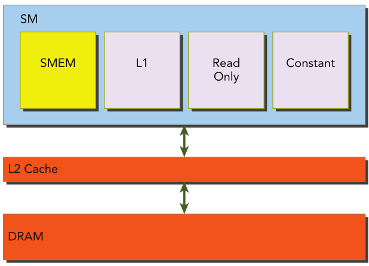
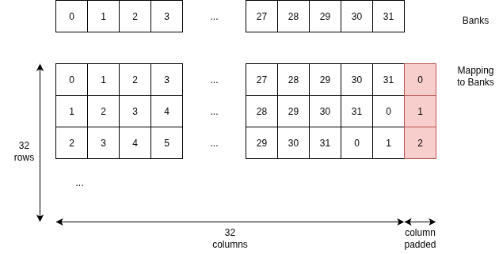

## Chapter 5 Shared Memory (and Constant Memory)

## 📌 Highlights
- Shared memory is a program-managed cache within the CUDA memory hierarchy that can be explicitly controlled to significantly improve performance.
- There are two main reasons to use shared memory in a CUDA kernel. One is to cache data on-chip, which helps reduce the number of global memory transactions. The other is to rearrange data in shared memory in a way that avoids non-coalesced global memory accesses, leading to more efficient memory access.
- The shared memory address space is partitioned among all resident thread blocks and is shared by all threads within a thread block. Its contents have the same lifetime as the thread block in which it was created and may limit kernel occupancy due to limited size of shared memory.
- Shared memory acesses are issued per warp. Ideally, each request to access shared memory by a warp is serviced in one transaction. To achieve this, or high memory bandwidth, note that shared memory is divided into 32 equally-sized memory modules *banks*, which can be accessed simultaneously. When multiple separate address request in a shared memory fall into the same memory bank, a *bank conflict* occurs, causing the transaction to be replayed. The art of CUDA programming that implements shared memory access is subject to avoid this *bank conflict*, where *padding* would be a reasonable option.
- Constant memory is optimized for read-only data that is broadcast to many threads at a time.
  <div style="display: inline-block; vertical-align: top;">
    <br>
    <strong>Figure 1-9. The CUDA Memory Hierarchy (Cheng et al.)</strong><br>
  </div>

## 🧪 Exercise 5-1
Suppose you have a shared memory tile with dimensions [32][32]. Pad a column to it and then draw an illustration showing the mapping between data elements and banks for a Kepler device in 4-byte access mode.

### 🔑 Illustration and Key Ideas
  <div style="display: inline-block; vertical-align: top;">
    <br>
    <strong>Padding an additional column</strong><br>
  </div>
- Shared memory acesses are issued per warp of 32 threads. 
- Data elements are divided into 32 equally-sized memory modules *banks*. Each box's index indicates the allocated memory banks.
- The red-highlighted column represents padding — an extra column added to each row in shared memory. This avoids bank conflicts during column-major access by setting the offset each row’s starting address, ensuring that accesses fall into different banks instead of all hitting the same one.
- In row-major access, thread t in a warp accesses element [row][t]. Since t ranges from 0 to 31, each thread accesses a different bank (t % 32), making the access fully parallel and conflict-free.
- In row-major access, thread `t` in a warp accesses element `[row][t]`. As `t` ranges from `0` to `31`, each thread accesses a different bank `(t % 32)`, leading to parallel and conflict-free access.


## 🧪 Exercise 5-2
Refer to the kernel `setRowReadCol` in the file `checkSmemSquare.cu`. Make a new kernel named `setColReadRow` to perform the operations of writing to columns and reading from rows. Check the memory transactions with `nvprof` and observe the output.

### 🔑 Key Ideas
- 

### 🛠️ (Optional) Implementation Details

### 📈 (Optioinal) Performance Metrics

### ✅ Execution Results
```bash
```


## 🧪 Exercise 5-3
Refer to the kernel `setRowReadColDyn` in the file `checkSmemSquare.cu`. Make a new kernel named `setColReadRowDyn` that declares shared memory dynamically, and then perform the operations of writing to columns and reading from rows. Check the memory transactions with `nvprof` and observe the output.


### 🔑 Key Ideas
- 

### 🛠️ (Optional) Implementation Details

### 📈 (Optioinal) Performance Metrics

### ✅ Execution Results
```bash
```


## 🧪 Exercise 5-4
Refer to the kernel `setRowReadColPad` in the file `checkSmemSquare.cu`. Make a new kernel named `setColReadRowPad` that pads by one column. Then, implement the operation of writing by columns and reading from rows. Check the memory transactions with `nvprof` and observe the output.


### 🔑 Key Ideas
- 

### 🛠️ (Optional) Implementation Details

### 📈 (Optioinal) Performance Metrics

### ✅ Execution Results
```bash
```


<!-------------------------------


## 🧪 Exercise 1-2

### 🔑 Key Ideas
- 

### 🛠️ (Optional) Implementation Details

### 📈 (Optioinal) Performance Metrics

### ✅ Execution Results
```bash
```


--------------------------------->
