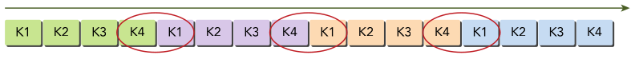
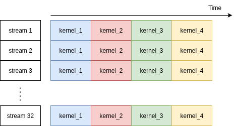
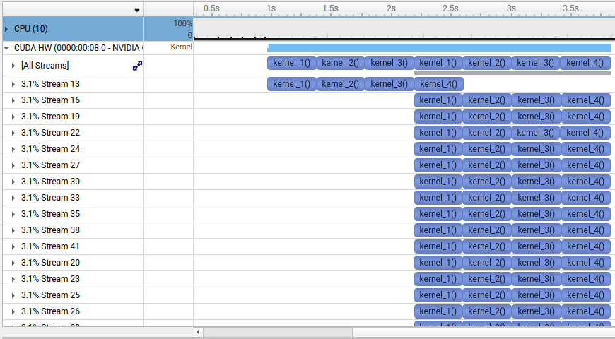

# Chapter 6 Streams and Concurrency

## 📌 Highlights
- Up to this point, the focus has been on *kernel level concurrency*, in which a single task, or kernel, is executed in parallel by many threads on the GPU, the performance of which depends on the programming model, execution model, and memory model points-of-view.
- In *grid level concurrency*, multiple kernel launches are executed simultaneously on a single device that can lead to better device utilization.
- At the core of this *grid level concurrency*, there are sequences of CUDA operations, namely CUDA *streams*. Streams can be used to implement pipelining, double buffering, or potential concurrent execution of kernels at the granularity of CUDA API calls. The functions in the CUDA API can typically classified as either synchronous(host thread blocking, the `NULL` stream) or asynchronous(returns control to the host immediately after being called, `non-NULL` streams). 
- Non-NULL streams can be further classified into two types: Blocking streams, Non-Blocking streams. (Streams can block other streams, not only the host!)
- Understanding the characteristics of these `NULL` or `non-NULL` streams is the key when it comes to understanding stream synchronization, concurrrent kernel execution, overlapping kernel execution, and overlapping GPU and CPU.

## 📌 Characteristics of Streams
- It is firstly important to know whether it's case about the blocking (or non-blocking) with respect to the *host* (thread) OR with respect to *other streams*! Streams can block both of them!
- All operations in non-default streams (`non-NULL`) are non-blocking with respect to the *host*.
- Kernel launches are always, whether `NULL` or `non-NULL` stream, asynchronous with respect to the *host*.
- Memory operations can inherently be synchronous such as `cudaMemcpy`, but asynchronous operation with `cudaMemcpyAsync` is possible. `cudaMemcpy` is not even a stream. it's just synchronous with respect to the host!
- The `NULL` stream, other than `non-NULL` stream, is synchronous stream with respect to the *host*. Most operations added to the `NULL` stream cause the *host* to block on all preceding operations, meaning that the *host* waits for operations that are previously added on the *device*. Kernel launch is exception.
- `Non-NULL` streams can be blocked by the `NULL` stream — if they are created as blocking streams (i.e., without the `cudaStreamNonBlocking` flag).


## 🧪 Exercise 6-1
Define the term “CUDA stream.” What kind of operations can be placed in a CUDA stream? What are the main benefits of using streams in an application?

### 🔑 Answer
A CUDA *stream* refers to a sequence of asynchronous CUDA operations that execute on a device in the order issued by the *host* code. There are mainly two kinds of operations that can be placed in a CUDA stream: memory-related operations and kernel launches. By dispatching kernel execution and memory operations into separate streams, these operations can be overlapped, and the execution time of the prograam can be shortened.

## 🧪 Exercise 6-2
How do events relate to streams? Give an example where a CUDA event would be useful and allow you to implement logic that you could not efficiently implement with streams alone.

### 🔑 Answer
A CUDA *event* is a marker in a CUDA stream associated with a certain point in the flow of operations. A CUDA *event* can let the user monitor device progress and is especially useful when stream executions should be synchronized. For example, the following code snippet shows that `kernelA` runs in `stream1` (non-NULL stream, asynchronous), event is queued in `stream1` after `kernelA`, `stream2` will wait for the `event` (`cudaStreamWaitEvent`), i.e., wait for `kernelA` to finish before running `kernelB`. This kind of synchronization is useful when there are dependencies between multiple streams. It may not be able to efficiently implement this kind of logic with streams alone, as kernel launches are asynchronous with respect to the host thread. 

``` cuda
cudaStream_t stream1, stream2;
cudaEvent_t event;

cudaStreamCreate(&stream1);
cudaStreamCreate(&stream2);
cudaEventCreate(&event);

// Launch kernel in stream1
kernelA<<<blocks, threads, 0, stream1>>>();

// Record an event in stream1 after kernelA
cudaEventRecord(event, stream1);

// Tell stream2 to wait for event before continuing
cudaStreamWaitEvent(stream2, event, 0);

// Now launch something in stream2
kernelB<<<blocks, threads, 0, stream2>>>();
```


## 🧪 Exercise 6-3
What can cause false dependencies on GPUs? How do these causes differ between the Fermi and Kepler architectures? How does Hyper-Q help to limit false dependencies?

### 🔑 Answer
In the Fermi GPU, all streams are known to be multiplexed into a single hardware work queue. Its single pipeline may result in a *false dependency*, meaning that only independent task pairs will be executed concurrently. *Hyper-Q* in the Kepler architecture, on the other hand, provides 32 hardware work queues, allowing the GPU to allocate one work queue per stream and thereby enables better concurrency across streams.

## 🧪 Exercise 6-4
Describe the difference between explicit and implicit synchronization. What are examples of specific CUDA API functions that create implicit host-device synchronization points?

### 🔑 Answer
The difference is that those explicit synchronization functions are inserted manually and are called by the *host* to synchronize the execution of tasks on the *device*. The primary purpose of the functions we often use for implicit synchronization is not actually synchronization itself.
For example, functions like `cudaMemcpy`, `cudaFree` are fundamentally intended for tasks such as data transfer or memory deallocation, but create implicit host-device synchronization points.

## 🧪 Exercise 6-5
How do depth-first and breadth-first ordering differ when executing work from CUDA streams? In particular, how does the Fermi architecture benefit from breadth-first ordering of work?

### 🔑 Answer
- Depth-first ordering dispatches the full set of operations for a stream before starting on the next stream. When using breadth-first order, operations assigned to different streams are enqueued in an alternating sequence.
- Depth-first ordering for the Fermi architecture leads to false-dependencies that the preceding streams block successive streams, as all streams are multiplexed into a single hardware work queue. Breadth-first ordering ensures that adjacent tasks in the single work queue are from different streams. There's no false-dependencies between any adjacent pairs of tasks that achieves concurrent execution.<br>
  <div style="display: inline-block; vertical-align: top;">
    <br>
    <strong>Figure 6-7. Depth-first Ordering for the Fermi architecture. Different colors represent different streams. 4 sequential kernels per stream are assumed. Kernels in the same stream are dependent. The last and the first kernel from two different streams have no dependencies for concurrrent execution. (Cheng et al.)</strong><br>
  </div>
    <div style="display: inline-block; vertical-align: top;">
    <br>
    <strong>Figure 6-8. Breadth-first Ordering for the Fermi architecture. No false-dependencies exist for adjacent tasks in the work queue. (Cheng et al.)</strong><br>
  </div>

## 🧪 Exercise 6-6
List the different types of CUDA overlapping. Describe the techniques that would be required to implement each.

### 🔑 Answer
There are 4 different types of coarse-grain concurrency introduced within this book:<br>
1. Overlapped host computation and device computation,<br>
2. Overlapped host computation and host-device data transfer,<br>
3. Overlapped host-device data transfer and device computation, and<br>
4. Concurrent device computation.<br>
- *Overlapped host computation and device computation* can be implemented by launching asynchronous operations, while the host executes its works. Note that kernel execution on device is asynchronous.
- *Overlapped host computation and host-device data transfer* is implemented by launching asynchronous data transfers in streams, while the host executes its works.
- *Overlapped host-device data transfer and device computation* is implemented by launching both an asynchronous kernel execution and an asynchronous data transfer, each of them in different CUDA streams for overlapping.
- *Concurrent device computation* is implemented by launching multiple asynchronous kernels in multiple different streams. Note that enough computational resources without dependencies between kernels should be available for concurrent execution.

## 🧪 Exercise 6-8
Draw the timeline produced by the following command on a Kepler device:
``` bash
$ nvvp ./simpleHyperqDepth
```
Assume that 32 streams are used. Explain the reasoning behind the timeline you drew.

### 🔑 Key Ideas
- Multiple hardware work queues(`HyperQ`) are available for devices Kepler or later. Although `simpleHyperqDepth` dispatches multiple streams in depth-first fashion, its scheduler is expected to remove false-dependencies and to find possible concurrent execution.
- Because each kernel launch is asynchronous with respect to the host, dispatching multiple kernels to different streams using a single host thread at approximately the same time may be possible.
- Assuming that 32 streams are used, concurrent execution of 32 streams is expected. (See diagramm for Exercise 6-8)<br>
  </div>
    <div style="display: inline-block; vertical-align: top;">
    <br>
    <strong>Diagramm for Exercise 6-8. Expected Concurrent Execution with 32 streams on a Kepler device. </strong><br>
  </div>
  
### 🛠️ Implementation Details
One key detail in `cuda_12.6` was to keep an additional branch so that the kernel will not be optimized away.
``` cuda
__global__ void kernel_1()
{
    double sum = 0.0;

    for(int i = 0; i < N; i++)
    {
        sum = sum + tan(0.1) * tan(0.1);
        // Exercise 6-8: Added branch so that the kernel will not be optimized away
        if (i == 100) printf("100 in kernel_1 reached.\n");
    }
}
```

To profile the application, run
``` bash
nsys profile -o simpleHyperqDepth ./simpleHyperqDepth
```
and load `simpleHyperqDepth.nsys-rep` in `nsys-ui`

### ✅ Execution Results
CUDA, in fact, doesn't launch all kernels at once, but the delay between kernel launches on the host side causes the streams to fill the GPU sequentially. The host code launches kernels, even if fast, that are not instantaneous and don't overlap. (See exported profile below) The first stream turns out to be dominant at the start, then at the point of `kernel_4` in the first stream all 32 streams run concurrently. Host code launches with multiple host threads using OpenMP could be following tasks to see if all 32 streams run concurrently from the beginning.<br>
  </div>
    <div style="display: inline-block; vertical-align: top;">
    <br>
    <strong>Exported Profile for Execution for Exercise 6-8. Note that the first 3 kernels of the first stream `stream13` is followed by concurrent kernel executions of other streams. </strong><br>
  </div>

<!-------------------------------


## 🧪 Exercise 1-2

### 🔑 Key Ideas
- 

### 🛠️ (Optional) Implementation Details

### 📈 (Optioinal) Performance Metrics

### ✅ Execution Results
```bash
```


--------------------------------->
